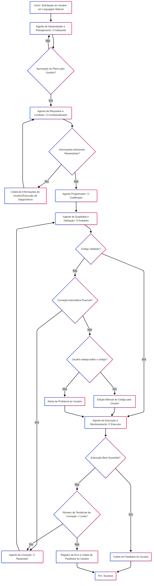

# Especialista-QGIS
O QGis Especialista tem como missão levar o poder do geoprocessamento (GIS) para todos os profissionais que atuam com dados espaciais, com especial atenção para agentes públicos, geólogos, engenheiros e profissionais da gestão de riscos urbanos.

## 🧠 Sistema de Agentes Inteligentes para o QGIS via Interface Conversacional

Este projeto tem como objetivo o desenvolvimento de um sistema de **agentes inteligentes especializados** que integrem o QGIS a uma **interface de linguagem natural**. A proposta é permitir que qualquer usuário, mesmo sem experiência em programação, possa solicitar tarefas espaciais no QGIS por meio de uma conversa simples com um assistente virtual.

A arquitetura é modular e baseada em **Google AI Studio**, **Google Colab** e **Python**, com planejamento para futura integração como **plugin nativo no QGIS**.

---

## ⚙️ Funcionamento Geral do Sistema

O sistema é composto por seis agentes cooperativos, cada um responsável por uma parte essencial do fluxo de trabalho:

### 🗣️ 1. **Agente Intérprete (Planejador Conversacional)**

* Recebe a solicitação em linguagem natural.
* Interpreta termos técnicos ou leigos.
* Gera um **plano de ação estruturado** e apresenta para validação do usuário.

### 📋 2. **Agente de Requisitos (Contextualizador)**

* Analisa o plano.
* Identifica informações faltantes.
* Realiza diagnósticos (plugins instalados, arquivos existentes etc.).
* Envia as informações ao próximo agente.

### 💻 3. **Agente Programador (Gerador de Código)**

* Gera código Python compatível com o QGIS.
* Adiciona verificações de ambiente e comentários.
* Prepara o código para ser validado.

### ✅ 4. **Agente de Qualidade (QA)**

* Revisa o código gerado.
* Verifica segurança, boas práticas e erros lógicos.
* Sugere correções ou tenta corrigi-las automaticamente.
* Informa o usuário se há riscos em seguir com o código como está.

### ⚠️ 5. **Agente Executor (em desenvolvimento)**

* **Este agente ainda não foi implementado**, pois o front-end no QGIS não ficou pronto a tempo para o desafio.
* A função de execução, temporariamente, é assumida diretamente pelo usuário ou repassada ao próximo agente.

### 🔁 6. **Agente Corretor (Reparador)**

* Recebe logs de erros ou mensagens de falha.
* Analisa a causa do problema.
* Tenta gerar uma nova versão corrigida do código.
* Reenvia para o QA e mantém histórico de tentativas.

---

## 🔁 Fluxo de Operação dos Agentes

```markdown

```

---

## 💡 Casos de Uso

O projeto tem aplicação direta em:

* **Órgãos públicos** e prefeituras que utilizam QGIS na análise de risco urbano.
* **Profissionais técnicos** que desejam automatizar tarefas repetitivas com linguagem natural.
* **Mapeamento de áreas de risco, impacto ambiental, acessibilidade urbana e saneamento.**

---

## 🚧 Estado Atual

* ✔️ Agentes Intérprete, Requisitos, Programador, QA concluídos.
* ⏳ Agente Executor em desenvolvimento (aguardando front-end no QGIS).
* 🚧 Agente reparador: Precisa de reparos (o.O)
* 🛠️ Projeto funcional via Google Colab, com geração de código pronta para testes manuais no QGIS.

---

## 📌 Próximos Passos

* Desenvolver o plugin frontend no QGIS.
* Integrar todos os agentes em um pipeline automático.
* Melhorar o controle de contexto e refinamento iterativo com logs de feedback real.

---

Se quiser, posso transformar isso também em um PDF de apresentação, diagrama interativo ou documentação HTML. É só pedir!
